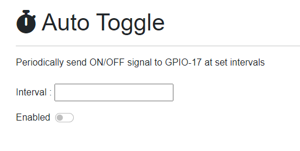

# RaspPi

## Examples

### Auto Toggle

Periodically send ON/OFF signal to GPIO-17 at set intervals

- Backend : [Pages/AutoToggle.razor.cs](./Pages/AutoToggle.razor.cs)
- Frontend : [Pages/AutoToggle.razor](./Pages/AutoToggle.razor)

